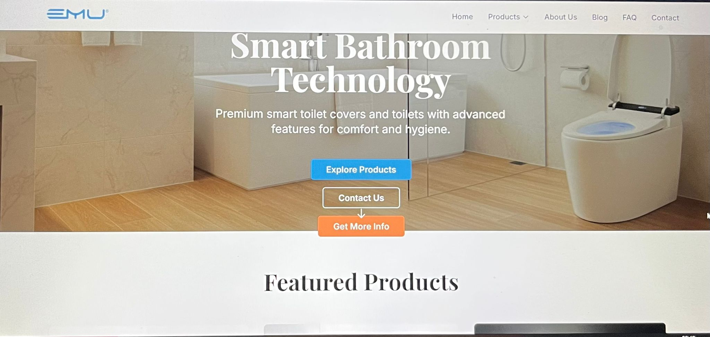
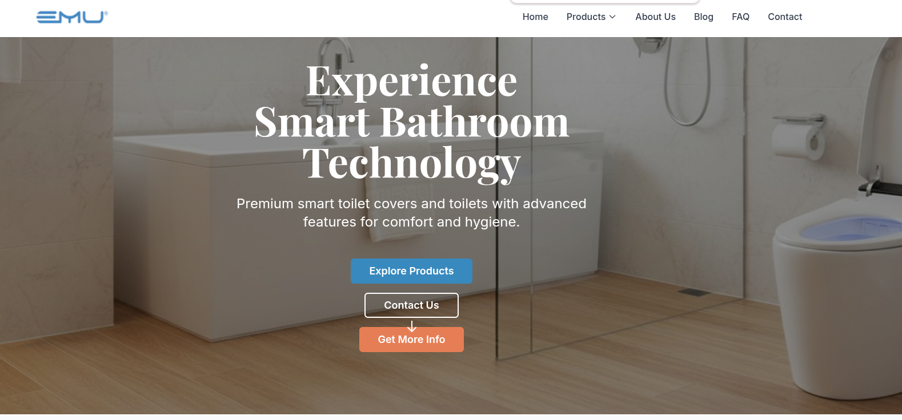
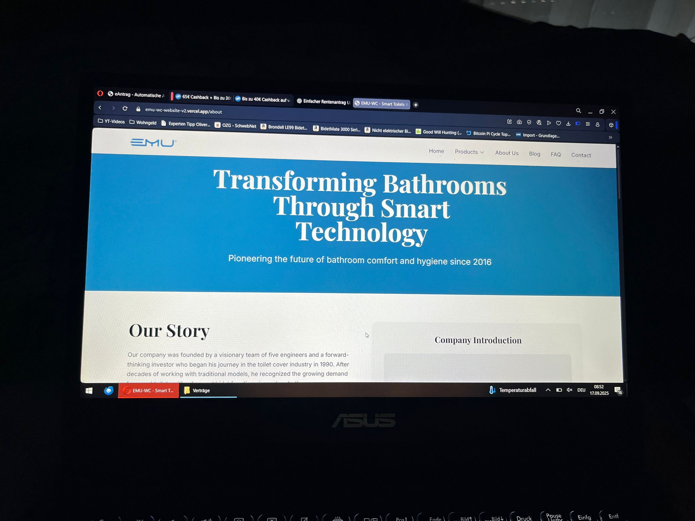
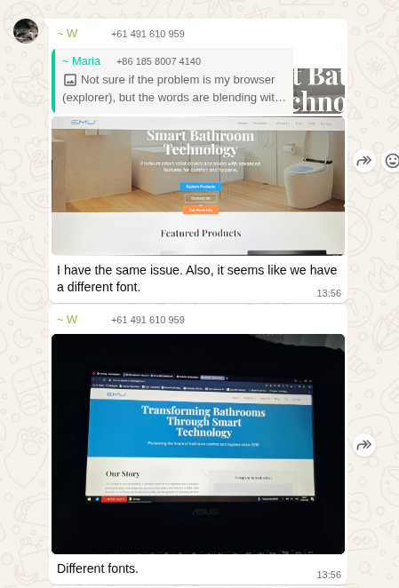
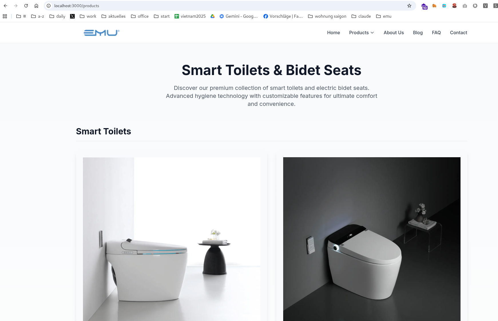
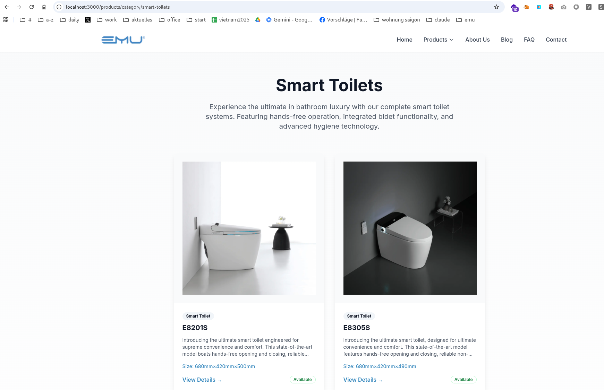
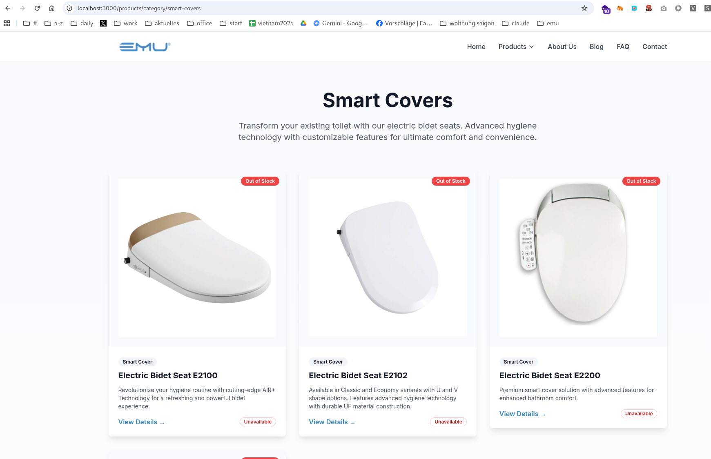
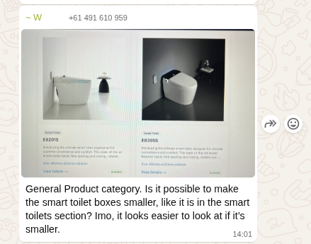

## 1. Hero
Der Kunde hat noch probleme bei der Hero anzeige der startseite: 
Sowohl Wal als auch Maria. Ich vermute weil die Internet explorer benutzen, habe schon gefragt, ob die den Zoom Faktor auf 100% gestellt haben, das haben die bestätigt, ist also nicht die Ursache. 
Bei mir sieht es korrekt aus, nänlich wie folgt: 
Bitte korrigiere es so dass es auch auf IE gut aussieht, also der Text vollständig zu sehen ist mit ausreichend margin zu den Rändern. 

## 2. different fonts in the heros 
außerdem beschwert er sich über different Fonts 
 vs. 
hat er Recht? wenn ja, dann bitte korrigieren, es muss natürlich über ALLE seiten konsistent sein, bitte auch andere Seiten prüfen, alle müssen für die hero section bzw generell immer den gleichen font und am besten auch die gleiche font size nutzen. 

## 3. Product Category Image Card size 
http://localhost:3000/products
http://localhost:3000/products/category/smart-covers
http://localhost:3000/products/category/smart-toilets

please always use the same size for all card. i.e. in the general product should be smaller 
same size like in smart toilets 
and Smart covers 
This is what wal said: General Product category. Is it possible to make the smart toilet boxes smaller, like it is in the smart toilets section? Imo, it looks easier to look at if it’s smaller.
